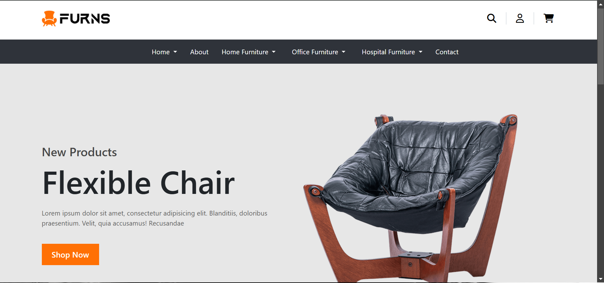

# Furniture Project

This is a furniture website project built using **Express.js**, **Bootstrap**, and **Node.js**. The project features a Node.js server with routing capabilities, providing a responsive user interface for a furniture store.

## Features

- Dynamic and responsive UI designed with Bootstrap.
- Server-side routing implemented using Express.js.
- Easy navigation through different sections of the website.
- Modular and scalable code structure.

## Technologies Used

- **Node.js**: For building the server-side logic.
- **Express.js**: For routing and handling requests.
- **Bootstrap**: For creating a responsive and visually appealing UI.

## Installation

Follow these steps to run the project on your local machine:

1. Clone the repository:
   git clone <repository-url>

2. Navigate to the project directory:
   cd furniture-project

3. Install the dependencies:
   npm install

4. Start the server:
   node app.js

5. Open the browser and go to:
   http://localhost:3000

## Project Structure

```
|-- public
|   |-- css
|   |   |-- styles.css    # Custom styles
|   |-- images            # Furniture images
|
|-- views
|   |-- index.ejs         # Home page template
|   |-- about.ejs         # About page template
|   |-- contact.ejs       # Contact page template
|
|-- app.js                # Main server file
|-- package.json          # Project metadata and dependencies
```

## Pages and Routing

- **Home Page (`/`)**: Displays the furniture catalog.
- **About Page (`/about`)**: Provides information about the furniture store.
- **Contact Page (`/contact`)**: Allows users to contact the store.

## Screenshots
### Home Page:


### About Page:


## Contributing

Feel free to contribute to the project by submitting pull requests. Ensure your code follows the project structure and is well-documented.


## License
This project is licensed under the MIT License.

---

### Author

Developed by **Yash**.
